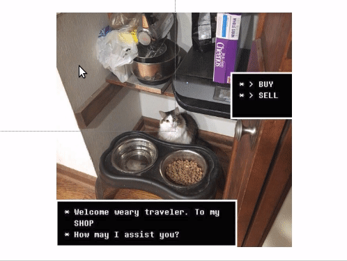

# Image Kebab<em>!</em>

This repository contains a web application designed to make it easy to transform and skew images in the browser. It was created to simplify the process of mapping an image onto a board or paper while transferring or enlarging a drawing, but should be useful for other purposes as well.

Visit the live application at [kadamwhite.github.io/image-kebab](https://kadamwhite.github.io/image-kebab).

## Usage

Use the image uploader to select an image to skew, or drag an image from your computer.

Once uploaded, click and drag in each corner of the screen to transform the image until it matches to your specifications.

## Technical Information & License

This project was bootstrapped with [Create React App](https://github.com/facebook/create-react-app), 

The source code for Image Kebab<em>!</em> is released under the terms of the [Artistic License, version 2.0](https://directory.fsf.org/wiki/License:Artistic-2.0).
